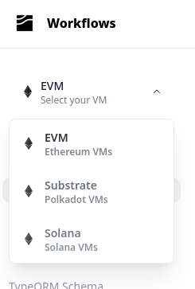

---

title: Home
hide_title: true
sidebar_position: 0
hide_table_of_contents: true
pagination_next: null

---

import NetworkChecker from '@site/src/components/NetworkChecker';
import SubstrateNetworkChecker from '@site/src/components/SubstrateNetworkChecker';
import SolanaNetworkChecker from '@site/src/components/SolanaNetworkChecker';


**Subsquid** is a fast, decentralized blockchain data lake and an indexing stack built on top of it. Get only the data you want, in bulk.

import Tabs from '@theme/Tabs';
import TabItem from '@theme/TabItem';

<details>
<summary>Which chains are in the data lake?</summary>

Over 200 in total, including
 - EVM / Ethereum-like. Full list:
   <NetworkChecker />
 - SVM / Solana-like. Full list:
   <SolanaNetworkChecker />
 - Substrate / Polkadot-like. Full list:
   <SubstrateNetworkChecker />
 - Miscellaneous: Tron, Starknet, Fuel

BTW you can choose one of the VMs / network types on the top left to only see content related to it.



</details>


<details>
<summary>What do you mean by "get only the data you want"?</summary>

The data lake supports a [rich system of data filters](/data-filters). Clients get pre-filtered data in chunks of up to ~200 Mbytes, saving a lot of network bandwidth.

</details>


<details>
<summary>Can I use Subsquid for data that's not in the data lake?</summary>

Yes
 - For chain data of networks not in the data lake you can ingest directly from RPC
 - You can mix in any external data during indexing, inc from IPFS, direct RPC calls, external HTTP APIs etc

</details>


<details>
<summary>How fast are we talking about?</summary>

| Data     | Time   | Link |
|:--------:|:------:|:----:|
| All USDT Transfer events on Ethereum | XX min | [gh repo](https://github.com/subsquid-labs/null) |
| All Pancakeswap PoolCreated events on Binance | XX min | [gh repo](https://github.com/subsquid-labs/null) |
| All USDT/USDC swaps on Raydium | XX min | [gh repo](https://github.com/subsquid-labs/null) |

</details>


<details>
<summary>How much does it cost?</summary>

During the current bootstrapping stage there are no query fees. Exact conditions depend on how you access the data:

 - Subsquid team's public portal has limited bandwidth, but is completely free of charge.
 - You can make your own portal and reserve network's bandwidth by locking SQD tokens. A minimal lockup of 10k SQD provides enough bandwidth for most users. You do get your tokens back when you terminate your portal.
 - If you're running your indexer in [Subsquid Cloud](/cloud) then the data lake queries are free and your monthly payment is determined solely by the hardware your indexer is using.

In the future query fees will be based on the cost of running the data lake. Currently these are in the range of 1-2 SQD ($0.15-0.30) per Mbit/s of bandwidth per month.

</details>


<details>
<summary>How hard is it to write Subsquid indexers?</summary>

See for yourself.

<Tabs queryString="code-sample">
<TabItem value="sdk1" label="Option 1: chain-to-GraphQL subgraph-like">

```ts
const processor = new EvmBatchProcessor()
  // Subsquid network access
  .setPortal('https://portal.sqd.dev/datasets/ethereum-mainnet')
  // Blockchain consensus can change.
  // How many blocks until we no longer anticipate such changes?
  .setFinalityConfirmation(75)
  // Requesting USDC Transfers
  .addLog({
    range: { from: 6_082_465 },
    address: [USDC_CONTRACT_ADDRESS],
    topic0: [usdcAbi.events.Transfer.topic],
  })
  // Requesting hashes of parent txs for every Transfer
  .setFields({
    log: {
      transactionHash: true,
    },
  })

// Writing to Postgres via TypeORM
const db = new TypeormDatabase({supportHotBlocks: true})

processor.run(db, async (ctx) => {
  const transfers: UsdcTransfer[] = []
  for (let block of ctx.blocks) {
    for (let log of block.logs) {
      if (log.address === USDC_CONTRACT_ADDRESS &&
          log.topics[0] === usdcAbi.events.Transfer.topic) {
        let {from, to, value} = usdcAbi.events.Transfer.decode(log)
        transfers.push(new UsdcTransfer({
          id: log.id,
          block: block.header.height,
          from,
          to,
          value,
          txnHash: log.transactionHash
        }))
      }
    }
  }

  // Just one insert per batch of ~100 blocks:
  // saves a lot of database IO bandwidth
  await ctx.store.insert(transfers)
})
```

</TabItem>
<TabItem value="pipes" label="Option 2: unopinionated flexible library">

```ts
async function main() {
    let portal = new PortalClient({
        url: 'https://portal.sqd.dev/datasets/solana-mainnet',
        http: new HttpClient({
            retryAttempts: Number.POSITIVE_INFINITY,
        }),
        minBytes: 100 * 1024 * 1024,
    })

    let fromBlock = await portal.getHead().then((h) => (h?.number ?? 0) - 50_000)

    await solanaPortalDataSource({
        portal,
        query: {
            fields: {
                block: {number: true, timestamp: true, hash: true, parentHash: true},
                transaction: {signatures: true, err: true, transactionIndex: true},
                instruction: {
                    programId: true,
                    accounts: true,
                    data: true,
                    isCommitted: true,
                    transactionIndex: true,
                    instructionAddress: true,
                },
            },
            requests: [
                {
                    range: {from: fromBlock},
                    request: {
                        instructions: [
                            {
                                programId: ['whirLbMiicVdio4qvUfM5KAg6Ct8VwpYzGff3uctyCc'],
                                d8: ['0xf8c69e91e17587c8'],
                                isCommitted: true,
                                innerInstructions: true,
                            },
                        ],
                    },
                },
            ],
        },
    })
        .pipeTo(
            target({
                unfinalized: true,
                writer: async () => {
                    return {
                        offset: undefined,
                        write: async (batch) => {
                            console.log(`${batch.offset.number}/${batch.head.number}`)
                            return batch.offset
                        },
                        fork: async (fork) => {
                            console.log(fork.heads[fork.heads.length - 1]?.number)
                            return fork.heads[0]
                        },
                    }
                },
            }),
        )
}
```

</TabItem>
</Tabs>

</details>


<details>
<summary>You mention that Subsquid data lake is decentralized. How does that work?</summary>

Anyone can [join Subsquid network as a worker](/subsquid-network/worker) and serve the data, provided that they lock enough SQD tokens and have some hardware that meets the requirements. Currently there are over 3000 workers in the network.

Data is routed through portals and [anyone can run one of these](/subsquid-network/portal), provided that they lock enough SQD.

Dataset creation, ingestion and long-term storage are currently handled by the Subsquid team. We are, however, committed to transferring these functions to the SQD token holders once we're done developing.

</details>


<details>
<summary>Is Subsquid open source?</summary>

Yes. We do keep some software under wraps during development and testing, but eventually everything is released under Apache 2.0 or another FOSS license.

</details>